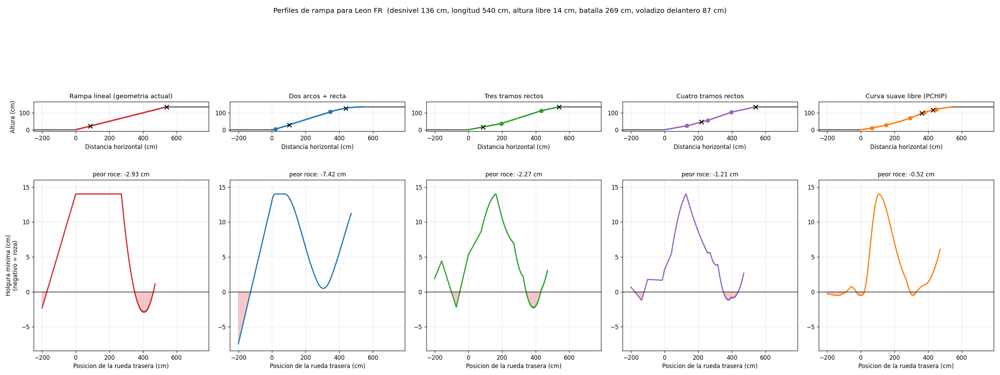
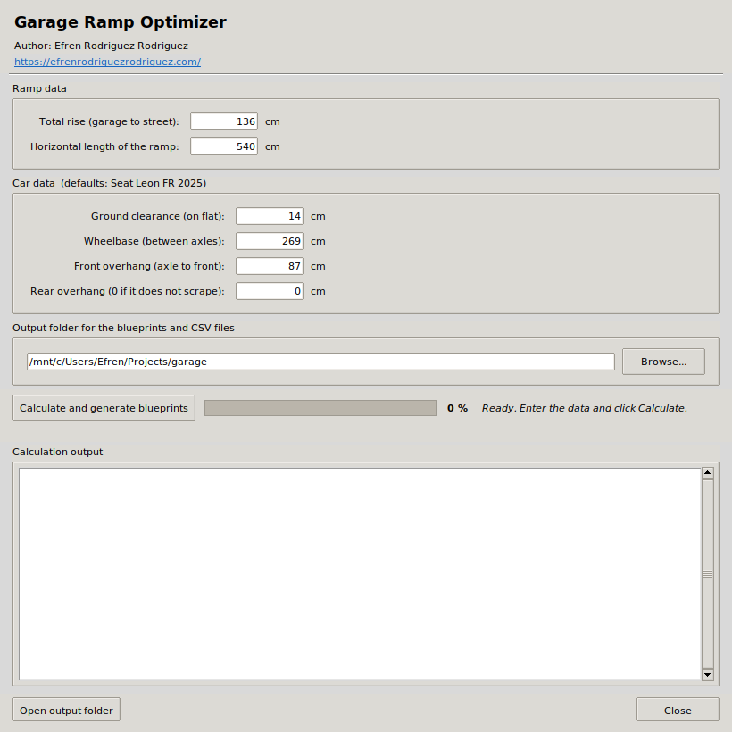
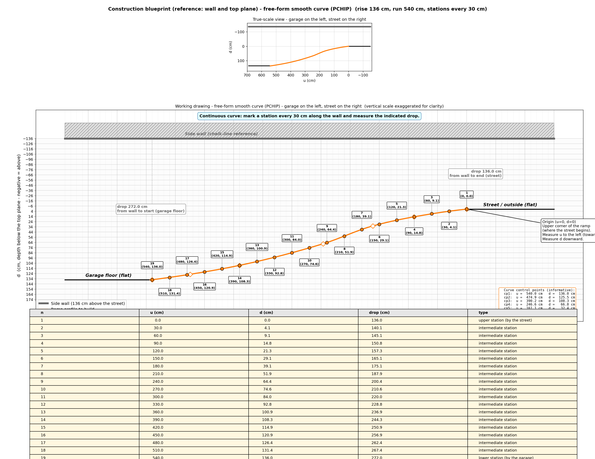
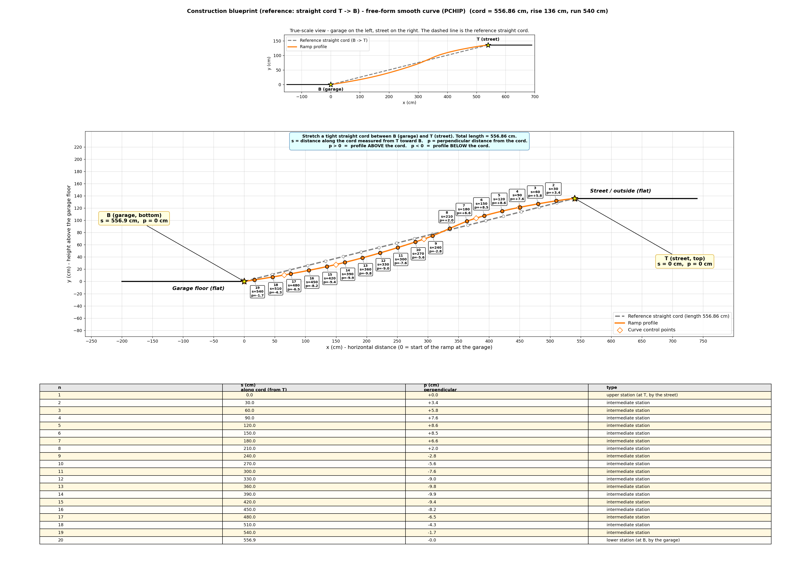

# Garage Ramp Optimizer

[](https://github.com/EfrenPy/garage-ramp-optimizer/releases/latest)
[](https://github.com/EfrenPy/garage-ramp-optimizer/actions/workflows/ci.yml)
[](https://github.com/EfrenPy/garage-ramp-optimizer/actions/workflows/release.yml)
[](https://codecov.io/gh/EfrenPy/garage-ramp-optimizer)
[](LICENSE)
[](https://www.python.org/downloads/)
[](https://github.com/astral-sh/ruff)

Compute the **optimal shape of a garage ramp** so a car does not scrape
its underbody when entering or exiting, given a fixed rise and a fixed
horizontal length.  Generates worker-friendly construction blueprints
(PNG + PDF) ready to be marked on the floor and on the side wall.


*Comparison of the five profile families the optimiser explores. The
free-form smooth curve (rightmost column) leaves only ~5 mm of
interference for the default Seat León FR 2025 + 136 cm rise / 540 cm
run scenario.*

## The problem

A ramp that climbs a large rise in a short run is geometrically
aggressive: with a constant slope and sharp corners at both ends, a low
car scrapes in two places:

1. The **front bumper / spoiler** scrapes the start of the ramp as the
   car enters (the front overhang sticks out over the slope before the
   front wheels reach it).
2. The **chassis between the wheels** scrapes at the top transition
   (high-centering): the car ends up resting on the crest with the
   wheels splayed on either side.

The fix is to give the ramp a **shape**, not a constant slope.  This
program tries five families of profiles, optimises each, and picks the
one that maximises the worst-case clearance.

## Profile families

| Profile | Description | Trade-off |
|---|---|---|
| **Linear ramp** | constant slope (the baseline). | reference. |
| **Two arcs + straight** | concave-up bottom arc + straight middle + concave-down top arc. | smooths both transitions with curves. |
| **3 piecewise slopes** | three straight sections (gentle, steep, gentle). | easy to build with planks and forms. |
| **4 piecewise slopes** | one extra break point for an even smoother transition. | better than 3 slopes without too much extra work. |
| **Smooth curve (PCHIP)** | monotone cubic spline through several optimised control points. | best geometric trade-off, almost no scraping. |

For each family the optimisation is:

- **Two arcs + straight**: refined grid search over (theta, R_top),
  with a lower bound on R_top to keep the crest from collapsing into a
  near-kink.
- **3 slopes**: 4-D grid search over (x1, y1, x2, y2).
- **4 slopes** and **smooth curve**: optimisation with
  [`scipy.optimize.differential_evolution`](https://docs.scipy.org/doc/scipy/reference/generated/scipy.optimize.differential_evolution.html),
  the two heavy searches running **in parallel**
  (`ProcessPoolExecutor`).

## Objective function

For each candidate, the simulator slides the car along the profile at
many positions and measures:

- the worst **between-wheels clearance** (high-centering risk), and
- the worst **front-overhang clearance** (bumper scrape risk).

The optimiser maximises the **smaller of the two** (min-max criterion).

## What it looks like

The GUI itself (Tkinter, ships inside the same `rampa.exe`):

<p align="center"></p>

## Sample blueprints

Two of the five worker blueprints generated for the default scenario
(Seat León FR 2025, 136 cm rise over 540 cm of run). All blueprints
ship as both PNG and vector PDF — zoom into the PDF without
pixelation when you print or project them.

**Wall reference (smooth profile)** — chalk-line on the side wall as
the visual anchor; every station is `(u, d, drop-from-wall)`.



**Cord reference (smooth profile)** — straight cord stretched between
the upper corner T and the lower corner B; every station is `(s, p)`.



## Three coordinate systems for the worker

Each profile is published in three blueprints so the worker can pick
the easiest one for their setup:

1. **From the start of the ramp** (`ramp_blueprint*`): origin at the
   bottom of the ramp, x horizontal, y vertical.
2. **From the wall** (`ramp_blueprint_top*`): a horizontal chalk-line
   is drawn on the wall 136 cm above the street and the worker drops a
   tape measure straight down.  Each point becomes
   `(u, d, drop-from-wall)`.
3. **From a straight cord** (`ramp_blueprint_chord*`): a tight cord is
   stretched between the upper corner **T** and the lower corner **B**.
   Each point becomes `(s, p)`:
   - `s` = distance along the cord from T,
   - `p` = perpendicular distance to the cord (positive = surface
     **above** the cord, negative = surface **below**).

Every blueprint includes:

- A true-scale side view (correct proportions).
- A working drawing with the vertical scale exaggerated for clarity.
- A measurements table with every keypoint.

## Typical result

For a Seat León FR 2025 (ground clearance 14 cm, wheelbase 269 cm,
front overhang 87 cm) on a 136 cm rise over 540 cm of run:

| Profile | Worst scrape |
|---|---:|
| Linear ramp (current geometry) | **−7.9 cm** |
| Two arcs + straight | −12.8 cm |
| Three slopes | −2.3 cm |
| Four slopes | −1.2 cm |
| **Free-form smooth curve (PCHIP)** | **−0.14 cm** |

(Negative = the car scrapes that many cm somewhere along the ramp.)

The current run length cannot reach zero scraping without lengthening
the ramp by about 200 cm more, but the smooth curve already leaves
just over 1 mm of interference, essentially imperceptible.

## Languages

The application is **English by default**.  A Spanish version is
opt-in:

- **Compile a Spanish executable** with
  `python build_exe.py --spanish`.  The resulting `dist\rampa.exe`
  bundles a marker file that switches the GUI, the console output and
  the blueprint plots to Spanish.
- **At runtime**, override either way with the CLI flag
  `--lang en` or `--lang es`, or with the environment variable
  `RAMP_LANG=es`.

## Usage

### Windows (recommended)

1. Compile once:
   ```cmd
   python build_exe.py
   ```
   (or `python build_exe.py --spanish` for the Spanish version).
2. Double-click `dist\rampa.exe` and fill in the form.

Step-by-step build details in [`COMPILAR.md`](COMPILAR.md).

### Plain Python (any OS)

```bash
# Install dependencies once
python -m pip install numpy scipy matplotlib

# GUI mode
python ramp_optimizer.py

# CLI mode
python ramp_optimizer.py 136 540
python ramp_optimizer.py -d 136 -l 540 -c 14 -w 269 -f 87
python ramp_optimizer.py --lang es -d 136 -l 540
python ramp_optimizer.py --help
```

Parameters:

| flag | parameter | default |
|---|---|---:|
| `-d` / `--desnivel` / `--rise` | total rise (cm) | required |
| `-l` / `--longitud` / `--run` | horizontal length (cm) | required |
| `-c` / `--altura-libre` / `--clearance` | ground clearance (cm) | 14 |
| `-w` / `--batalla` / `--wheelbase` | wheelbase / distance between axles (cm) | 269 |
| `-f` / `--voladizo-delantero` / `--front-overhang` | front overhang (cm) | 87 |
| `-r` / `--voladizo-trasero` / `--rear-overhang` | rear overhang (cm) | 0 |
| `--lang` | UI language (`en` / `es`) | `en` |

## Repository layout

```
garage-ramp-optimizer/
├── ramp_optimizer.py            <- model + CLI + Tkinter GUI (single file)
├── build_exe.py                 <- builds rampa.exe with PyInstaller
├── pyproject.toml               <- project metadata + ruff / pytest config
├── requirements.txt             <- runtime + build dependencies
├── README.md                    <- this file
├── CHANGELOG.md
├── COMPILAR.md                  <- detailed build / usage guide
├── CONTRIBUTING.md              <- dev setup / submitting PRs / i18n notes
├── SECURITY.md                  <- vulnerability reporting policy
├── LICENSE                      <- MIT
├── .gitignore
├── .github/
│   ├── workflows/
│   │   ├── ci.yml               <- lint + tests on push / PR
│   │   └── release.yml          <- builds rampa-en.exe + rampa-es.exe on tag
│   ├── ISSUE_TEMPLATE/
│   ├── PULL_REQUEST_TEMPLATE.md
│   └── dependabot.yml
├── tests/                       <- pytest suite (chord coords, profiles, i18n,
│   │                                evaluator invariants, dataclasses)
│   ├── conftest.py
│   ├── test_chord_coords.py
│   ├── test_dataclasses.py
│   ├── test_evaluate.py
│   ├── test_i18n.py
│   └── test_profiles.py
└── docs/
    ├── ramp_profile.png         <- sample comparison plot for the README
    ├── sample_wall_smooth.png   <- sample wall-reference blueprint
    └── sample_chord_smooth.png  <- sample cord-reference blueprint
```

When you run the optimiser it generates additional files in your
chosen output folder (these are intentionally kept out of git via
`.gitignore`):

```
ramp_blueprint.png/.pdf                    (3 slopes, base reference)
ramp_blueprint_top.png/.pdf                (3 slopes, wall reference)
ramp_blueprint_top_4slope.png/.pdf         (4 slopes, wall reference)
ramp_blueprint_top_smooth.png/.pdf         (smooth curve, wall reference)
ramp_blueprint_chord_4slope.png/.pdf       (4 slopes, cord reference)
ramp_blueprint_chord_smooth.png/.pdf       (smooth curve, cord reference)
ramp_profile.png/.pdf                      (5-profile comparison)
ramp_offsets_*.csv                         (construction tables)
```

## Dependencies

- Python 3.10+
- numpy
- scipy (≥ 1.7)
- matplotlib
- Tkinter (bundled with Python on Windows and macOS; on Linux you may
  need the `python3-tk` system package).
- PyInstaller (only if you want to compile the `.exe`).

## Author

**Efrén Rodríguez Rodríguez**
Personal website: <https://efrenrodriguezrodriguez.com/>
